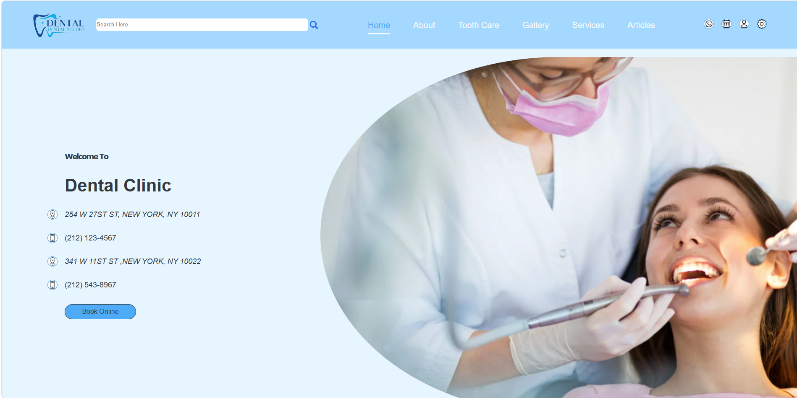
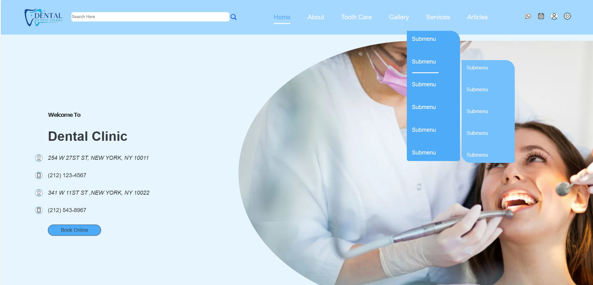
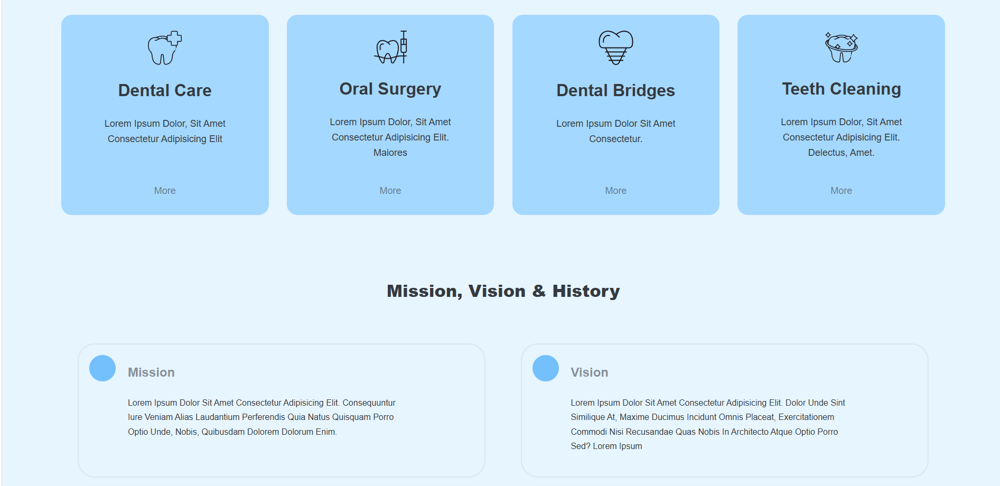
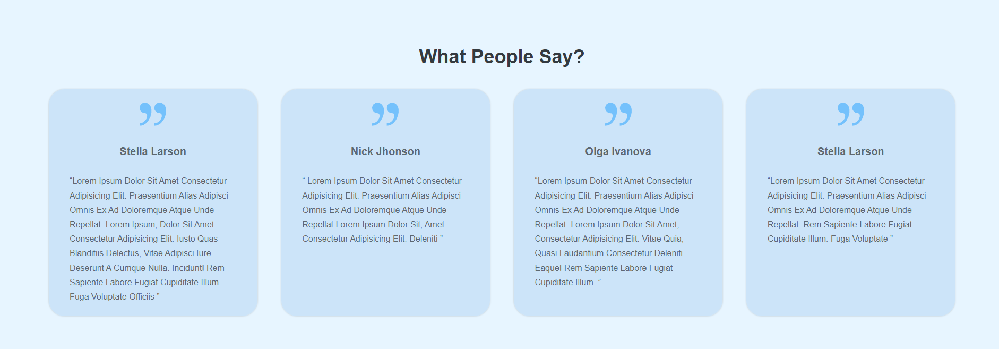
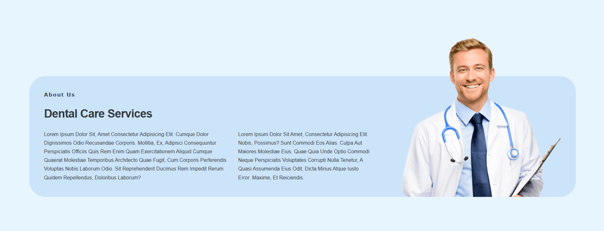
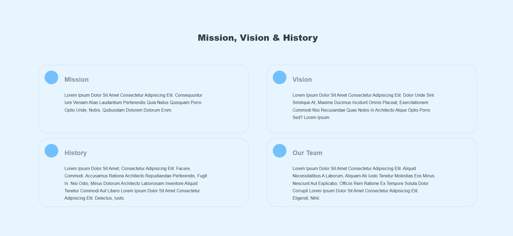
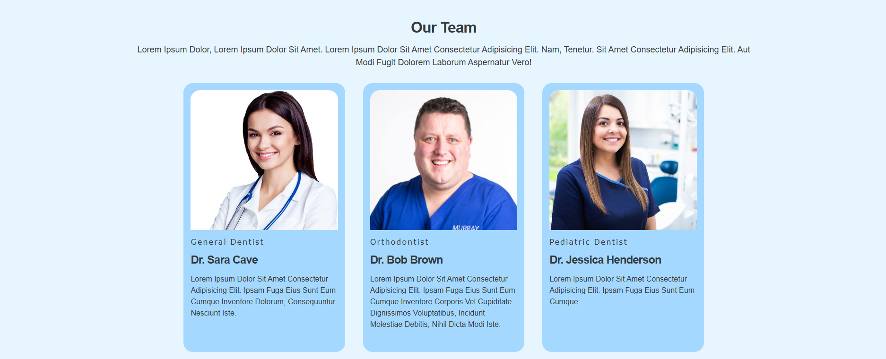
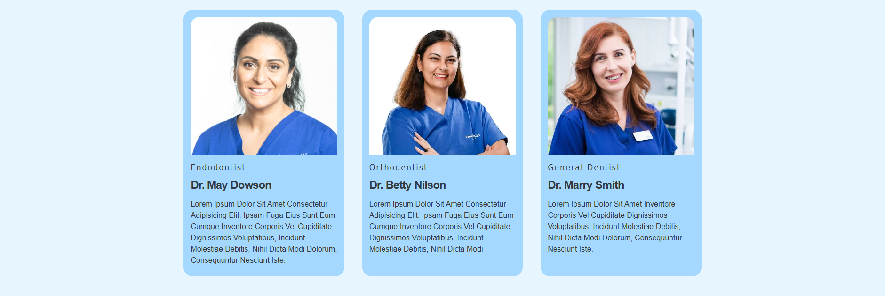
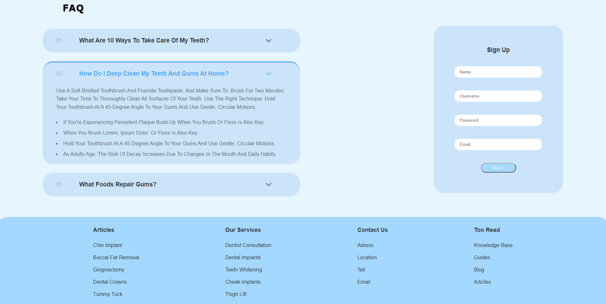

# Dental Clinic Website

A front-end dental clinic website concept with a clean blue visual system, service cards, clinic information, testimonials, team profiles, FAQs, authentication UI, and multi-level navigation.

The interface is designed around reusable content sections and cards, with rounded containers, generous spacing, and a consistent light-blue palette.

## Features

- Responsive-style clinic landing page layout
- Header navigation with search and utility icons
- Multi-level hover dropdown navigation
- Clinic contact information and online booking CTA
- Dental service cards
- Mission, vision, history, and team information sections
- Patient testimonial cards
- Staff/profile cards for multiple dental specialties
- Expandable FAQ/accordion interface
- Sign-up form UI
- Multi-column footer navigation

## Screenshots

### 1. Home / Hero Section



The landing section combines a fixed-width navigation header with a search field, primary navigation links, utility icons, clinic contact details, and a **Book Online** call-to-action. The hero image is clipped with a large curved/elliptical edge to create the split-layout treatment between textual content and imagery.

### 2. Multi-Level Hover Menu



The navigation supports a multi-level dropdown system. Hovering over a parent menu item opens the first submenu, while hovering over an eligible submenu item reveals a second nested menu positioned beside it. The dropdown panels use rounded corners, contrasting blue backgrounds, vertical menu spacing, and an active-item indicator.

### 3. Services and Mission / Vision Preview



A four-column service-card grid presents core treatments such as dental care, oral surgery, dental bridges, and teeth cleaning. Each reusable card contains an icon, heading, short description, and secondary **More** action. Below the grid, the page introduces the clinic's mission and vision using large bordered information panels.

### 4. Testimonials



The testimonial section uses a four-column card layout with a centered section heading. Each card contains a decorative quotation mark, patient name, and testimonial copy. Consistent card dimensions, rounded corners, and spacing maintain a uniform component-based layout.

### 5. About / Dental Care Services



This section uses a wide rounded content container with a two-column text layout and a transparent-background doctor image layered on the right. The composition demonstrates image positioning and overlap while keeping descriptive content readable within the main panel.

### 6. Mission, Vision, History & Team



The extended information section arranges **Mission**, **Vision**, **History**, and **Our Team** in a two-by-two grid. Each panel uses the same reusable component structure: a circular accent, section heading, supporting copy, subtle border, and rounded corners.

### 7. Team Members — First Row



The team area presents staff profiles as reusable cards. Each profile includes a portrait, specialty label, dentist name, and short biography. The first row demonstrates three specialties: general dentistry, orthodontics, and pediatric dentistry.

### 8. Team Members — Second Row



The second team row continues the same card component and grid alignment for additional specialists. Keeping image dimensions, typography, padding, and card sizing consistent allows new staff members to be added without changing the overall layout structure.

### 9. FAQ, Sign-Up Form & Footer



The FAQ area uses an accordion interaction: selecting a question expands its answer while the remaining questions stay collapsed. Alongside it is a compact sign-up form with name, username, password, and email fields. The page finishes with a rounded, multi-column footer containing grouped links for articles, services, contact information, and additional reading.

## UI / Interaction Notes

The project demonstrates several common front-end patterns: CSS hover states for nested navigation, reusable cards and grid layouts, layered/positioned imagery, accordion-style content expansion, form controls, call-to-action buttons, and consistent border-radius and spacing tokens across sections.

## Suggested Project Structure

```text
.
├── index.html
├── css/
│   └── style.css
├── js/
│   └── script.js
├── images/
│   └── ...
├── screenshots/
│   ├── home.png
│   ├── dropdown-menu.png
│   ├── services.png
│   ├── testimonials.png
│   ├── about-services.png
│   ├── mission-history.png
│   ├── team-row-1.png
│   ├── team-row-2.png
│   └── faq-footer.png
└── README.md
```

> **Note:** Rename the screenshot files or update the Markdown image paths above to match the filenames used in your repository.

## Running the Project

If the project is built with plain HTML, CSS, and JavaScript, clone the repository and open `index.html` in a browser. For development, a local static server such as the VS Code Live Server extension can be used to automatically refresh the page after changes.

## Technologies

- HTML5
- CSS3
- JavaScript

## Status

Front-end dental clinic website design / UI implementation.
